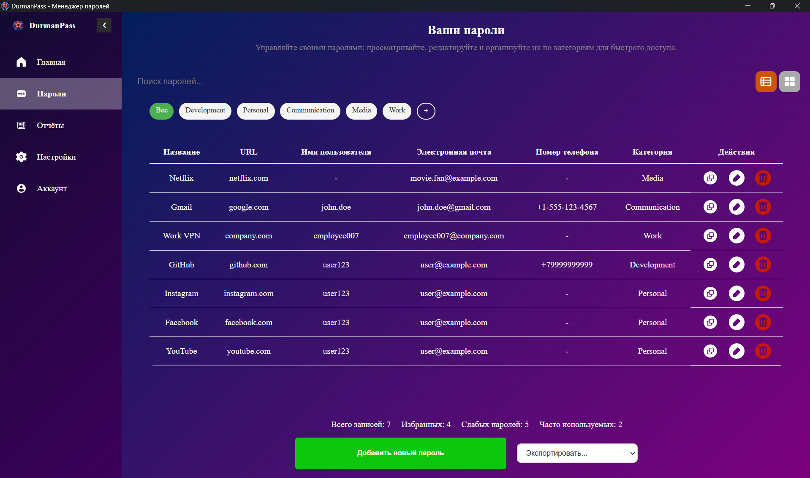

# DurmanPass
<div align="center">
  
</div>

## Что такое DurmanPass?

DurmanPass — это современный менеджер паролей, разработанный для безопасного хранения, управления и анализа учётных данных. Построенный на Angular и Tauri, он сочетает высокую производительность, кроссплатформенность и удобный интерфейс, предоставляя пользователям инструменты для повышения безопасности их паролей и защиты от уязвимостей.

Для загрузки последней версии DurmanPass перейдите на [https://durmanpass.ru/](https://durmanpass.ru/) и следуйте инструкциям по установке для вашей операционной системы. Сайт также предоставляет дополнительную информацию о функциях программы.


### Основные возможности
- **Хранение учётных данных**: Надёжное сохранение паролей, логинов, URL и категорий с поддержкой локального шифрования.
- **Анализ безопасности**: Оценка силы паролей и проверка URL на наличие HTTPS и подозрительных доменов.
- **Генерация отчётов**: Подробные HTML-отчёты о слабых паролях, переиспользуемых паролях и небезопасных сайтах.

## Локальная установка

1. **Требования**:
    - Node.js (версия 18+)
    - Rust (для сборки Tauri)
    - npm или yarn

2. **Клонирование репозитория**:
   ```bash
   git clone https://github.com/DurmanPass/Durman-Desktop
   cd Durman-Desktop
   ```

3. **Установка зависимостей**:
   ```bash
   npm install
   ```

4. **Запуск в режиме разработки**:
   ```bash
   npm run tauri dev
   ```

5. **Сборка приложения**:
   ```bash
   npm run tauri build
   ```